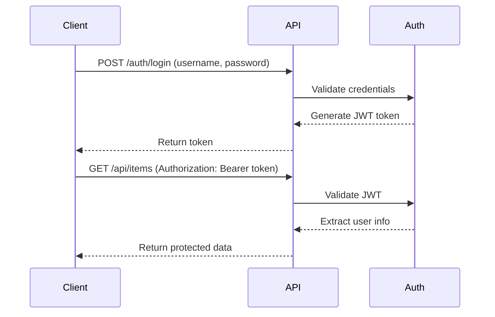

# JWT Authentication Guide

## Overview

The finEdSkywalker API now includes JWT-based authentication to secure your endpoints. This guide explains how to use the authentication system.

## Authentication Flow



## Public Endpoints (No Authentication Required)

- `GET /health` - Health check
- `POST /auth/login` - User login
- `POST /auth/refresh` - Token refresh

## Protected Endpoints (JWT Required)

- `GET /api/items` - List all items
- `POST /api/items` - Create a new item
- `GET /api/items/:id` - Get a specific item

## Usage Examples

### 1. Login and Get Token

```bash
curl -X POST http://localhost:8080/auth/login \
  -H "Content-Type: application/json" \
  -d '{"username":"alice","password":"password123"}'
```

Response:
```json
{
  "token": "eyJhbGciOiJIUzI1NiIsInR5cCI6IkpXVCJ9...",
  "username": "alice",
  "message": "Login successful"
}
```

### 2. Access Protected Endpoint

```bash
TOKEN="your-jwt-token-here"

curl http://localhost:8080/api/items \
  -H "Authorization: Bearer $TOKEN"
```

### 3. Create an Item (Authenticated)

```bash
curl -X POST http://localhost:8080/api/items \
  -H "Authorization: Bearer $TOKEN" \
  -H "Content-Type: application/json" \
  -d '{"name":"My Item","description":"Item description"}'
```

## Managing Users

### Adding New Users

Use the password hash generator tool:

```bash
# Generate a password hash
./bin/hashgen

# Follow the prompts to enter username and password
# Copy the generated code snippet to internal/auth/users.go
```

Or build it first:

```bash
go build -o bin/hashgen ./cmd/hashgen/main.go
./bin/hashgen
```

### Example Output

```
=== Password Hash Generator for finEdSkywalker ===

Enter username: john
Enter password: ****
Confirm password: ****

Generating password hash...

=== Generated Credentials ===
Username: john
Password Hash: $2a$10$...

=== Go Code Snippet ===
{"john", "$2a$10$..."},

=== Add to internal/auth/users.go ===
Copy the Go code snippet above and add it to the defaultUsers array
```

Then update `internal/auth/users.go`:

```go
defaultUsers := []struct {
    id       string
    username string
    password string
}{
    {"1", "alice", "password123"},
    {"2", "bob", "password123"},
    {"3", "admin", "admin123"},
    {"4", "john", "$2a$10$..."}, // Add your new user here
}
```

## Environment Variables

### Required

- `JWT_SECRET` - Secret key for signing JWT tokens (min 32 characters recommended)

Example:
```bash
export JWT_SECRET="your-super-secret-key-here-min-32-chars"
```

### Terraform Configuration

When deploying with Terraform, set the JWT secret:

```bash
cd terraform

# Set the JWT secret as a variable
export TF_VAR_jwt_secret="your-production-secret-key-here"

# Or create a terraform.tfvars file
echo 'jwt_secret = "your-production-secret-key-here"' > terraform.tfvars

terraform plan
terraform apply
```

**Important:** Use a strong, randomly generated secret for production!

Generate a secure secret:
```bash
openssl rand -base64 32
```

## Token Details

- **Algorithm:** HS256 (HMAC with SHA-256)
- **Expiration:** 24 hours
- **Claims:**
  - `user_id` - User's unique identifier
  - `username` - Username
  - `iss` - Issuer (finEdSkywalker)
  - `sub` - Subject (user ID)
  - `exp` - Expiration timestamp
  - `iat` - Issued at timestamp
  - `nbf` - Not before timestamp

## Error Responses

### 401 Unauthorized

Missing or invalid authentication:

```json
{
  "error": "Unauthorized",
  "message": "Missing authorization header"
}
```

```json
{
  "error": "Unauthorized",
  "message": "Invalid token"
}
```

```json
{
  "error": "Unauthorized",
  "message": "Token has expired"
}
```

### 400 Bad Request

Invalid login credentials:

```json
{
  "error": "Authentication failed",
  "message": "Invalid username or password"
}
```

## Security Best Practices

### Development

1. Use a strong JWT secret (min 32 characters)
2. Never commit JWT secrets to git
3. Rotate secrets regularly
4. Use HTTPS in production

### Production

1. **Store JWT_SECRET in AWS Secrets Manager** (recommended)
   - More secure than environment variables
   - Automatic rotation support
   - Audit logging

2. **Enable CloudWatch Logging**
   - Monitor authentication failures
   - Track suspicious activity

3. **Implement Rate Limiting**
   - Limit login attempts
   - Prevent brute force attacks

4. **Use Strong Passwords**
   - Minimum 12 characters
   - Mix of uppercase, lowercase, numbers, symbols

5. **Consider Additional Security Layers**
   - Multi-factor authentication (MFA)
   - IP whitelisting
   - API Gateway throttling

## Testing

Run the test suite:

```bash
# Start local server with JWT secret
JWT_SECRET="test-secret-key" go run cmd/local/main.go

# In another terminal, run tests
./scripts/test-auth.sh
```

## Troubleshooting

### "JWT_SECRET environment variable not set"

Make sure JWT_SECRET is set in your environment:

```bash
export JWT_SECRET="your-secret-key"
```

### "Invalid token" errors

1. Check that the token is being sent correctly in the Authorization header
2. Ensure the format is: `Authorization: Bearer <token>`
3. Verify the JWT_SECRET matches between token generation and validation
4. Check if the token has expired (24 hour lifetime)

### Login fails with valid credentials

1. Verify the user exists in the user store
2. Check password hash is correct
3. Review server logs for detailed error messages

## Migration from Unauthenticated API

If you have existing clients using the API:

1. **Phase 1:** Deploy the new version (backward compatible)
   - Public endpoints remain accessible
   - Protected endpoints require auth

2. **Phase 2:** Update clients to use authentication
   - Implement login flow
   - Store and use JWT tokens
   - Handle token expiration

3. **Phase 3:** Remove unauthenticated access (optional)
   - All endpoints require authentication
   - Remove public access exceptions

## Next Steps

- Implement token refresh mechanism
- Add user management endpoints (create/update/delete users)
- Integrate with a database for user storage
- Add role-based access control (RBAC)
- Implement password reset functionality
- Add account lockout after failed login attempts

