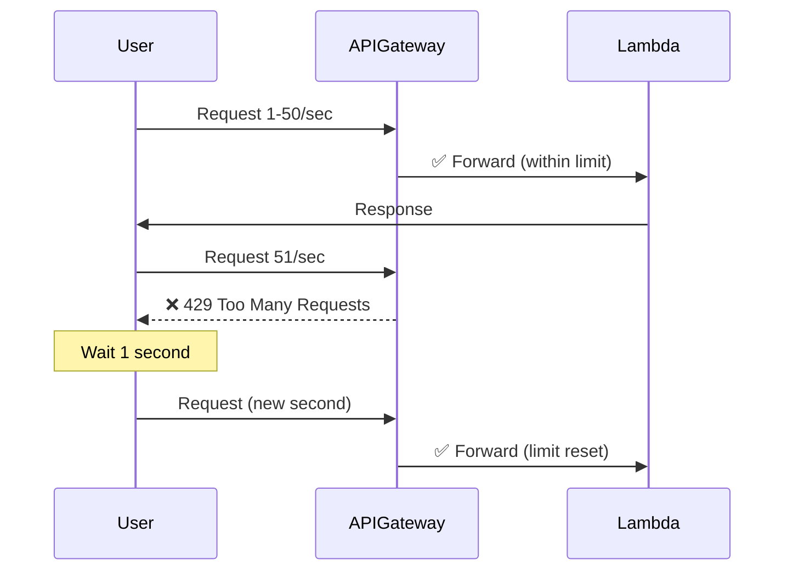

# API Security & Rate Limiting

## Overview

Your API includes multiple layers of security protection to prevent DDoS, abuse, and cost overruns.

## Rate Limiting Configuration

### API Gateway Throttling

**Current Settings:**
```hcl
throttling_burst_limit = 100   # Max concurrent requests
throttling_rate_limit  = 50    # Max requests per second
```

**What this means for 10 users:**
- Each user can make up to 5 requests/second on average
- Burst handling allows temporary spikes up to 100 concurrent requests
- Excess requests get HTTP 429 (Too Many Requests)

### How Rate Limiting Works



## Security Layers

### 1. API Gateway Rate Limiting
**Location:** `terraform/lambda.tf` - API Gateway Stage

```hcl
default_route_settings {
  throttling_burst_limit = var.api_throttle_burst_limit  # Default: 100
  throttling_rate_limit  = var.api_throttle_rate_limit   # Default: 50/sec
}
```

**Protection Against:**
- ✅ DDoS attacks
- ✅ API abuse
- ✅ Accidental infinite loops in client code
- ✅ Cost overruns from excessive requests

**Response when exceeded:**
```json
{
  "message": "Too Many Requests"
}
```
HTTP Status: 429

### 2. Lambda Concurrency Limits
**Location:** `terraform/lambda.tf` - Lambda Function

```hcl
reserved_concurrent_executions = 10
```

**What this means:**
- Maximum 10 Lambda instances running simultaneously
- Prevents runaway costs if rate limiting bypassed
- For 10 users: Each user effectively gets 1 concurrent execution

**Cost Protection:**
- Without limit: Attacker could spawn thousands of Lambda instances
- With limit: Maximum cost capped at 10 concurrent executions

### 3. JWT Authentication
**Protection Against:**
- ✅ Unauthorized access
- ✅ Anonymous abuse
- ✅ Account sharing

Only authenticated users with valid JWT tokens can access protected endpoints.

### 4. CloudWatch Monitoring
**Automatic tracking of:**
- Request count per endpoint
- Error rates (4xx, 5xx)
- Latency
- Throttled requests

## Customizing Rate Limits

### For Your 10 Users

**Conservative (Recommended for start):**
```bash
cd terraform
terraform apply \
  -var="api_throttle_burst_limit=50" \
  -var="api_throttle_rate_limit=25"
```
- 25 requests/second total across all users
- 2.5 requests/second per user average

**Moderate (Current default):**
```bash
# Already configured
throttling_burst_limit = 100
throttling_rate_limit  = 50
```
- 50 requests/second total
- 5 requests/second per user average

**Liberal (if users need more):**
```bash
terraform apply \
  -var="api_throttle_burst_limit=200" \
  -var="api_throttle_rate_limit=100"
```
- 100 requests/second total
- 10 requests/second per user average

### Calculating Your Needs

**Example usage patterns:**

| Scenario | Requests/sec/user | Total (10 users) | Recommended Limit |
|----------|-------------------|------------------|-------------------|
| Mobile app (light) | 1-2 | 10-20/sec | 25-50/sec |
| Web dashboard | 2-5 | 20-50/sec | 50-100/sec |
| Heavy data app | 5-10 | 50-100/sec | 100-200/sec |
| Real-time updates | 10+ | 100+/sec | 200+/sec |

**Your current config (50/sec) is good for:**
- ✅ Web dashboard with moderate usage
- ✅ Mobile apps with periodic syncing
- ✅ Small team collaboration tools

## Cost Implications

### With Rate Limiting (Protected)

**Worst case scenario (DDoS attempt):**
```
Rate limit: 50 requests/sec
Attack duration: 1 hour
Total requests: 50 * 3600 = 180,000 requests
Lambda cost: ~$0.004 (within free tier)
API Gateway cost: ~$0.18 ($1 per million requests)

Total damage: ~$0.18
```

### Without Rate Limiting (Unprotected)

**Same DDoS scenario:**
```
No limit
Attacker sends: 10,000 requests/sec
Duration: 1 hour
Total requests: 10,000 * 3600 = 36,000,000 requests
Lambda cost: ~$10-50 (depends on execution time)
API Gateway cost: ~$36

Total damage: $46-86
Plus potential AWS account suspension!
```

## Additional Security Measures

### 1. Enable AWS WAF (Optional, but Recommended)

Add AWS WAF for advanced protection:

```hcl
# terraform/waf.tf (create this file)
resource "aws_wafv2_web_acl" "api" {
  name  = "finEdSkywalker-api-waf"
  scope = "REGIONAL"

  default_action {
    allow {}
  }

  # Rate limiting rule
  rule {
    name     = "RateLimitRule"
    priority = 1

    statement {
      rate_based_statement {
        limit              = 1000
        aggregate_key_type = "IP"
      }
    }

    action {
      block {}
    }

    visibility_config {
      cloudwatch_metrics_enabled = true
      metric_name                = "RateLimitRule"
      sampled_requests_enabled   = true
    }
  }

  visibility_config {
    cloudwatch_metrics_enabled = true
    metric_name                = "finEdSkywalkerWAF"
    sampled_requests_enabled   = true
  }
}
```

**Cost:** ~$5/month + $1 per million requests
**Protection:** IP-based rate limiting, SQL injection, XSS attacks

### 2. CloudWatch Alarms

Monitor and alert on suspicious activity:

```hcl
# terraform/alarms.tf (create this file)
resource "aws_cloudwatch_metric_alarm" "high_4xx_errors" {
  alarm_name          = "finEdSkywalker-high-4xx-errors"
  comparison_operator = "GreaterThanThreshold"
  evaluation_periods  = "2"
  metric_name         = "4XXError"
  namespace           = "AWS/ApiGateway"
  period              = "300"
  statistic           = "Sum"
  threshold           = "100"
  alarm_description   = "Alert when too many 4xx errors (potential attack)"
  
  dimensions = {
    ApiName = aws_apigatewayv2_api.api.name
  }
}

resource "aws_cloudwatch_metric_alarm" "high_throttle" {
  alarm_name          = "finEdSkywalker-throttled-requests"
  comparison_operator = "GreaterThanThreshold"
  evaluation_periods  = "1"
  metric_name         = "Count"
  namespace           = "AWS/ApiGateway"
  period              = "60"
  statistic           = "Sum"
  threshold           = "50"
  alarm_description   = "Alert when requests are being throttled"
  
  dimensions = {
    ApiName = aws_apigatewayv2_api.api.name
  }
}
```

### 3. Lambda Reserved Concurrency

Already configured! This prevents cost overruns:

```hcl
reserved_concurrent_executions = 10
```

**Maximum possible Lambda cost per month:**
```
10 concurrent executions × 30 sec timeout × $0.0000166667/GB-sec
= ~$1-5/month maximum (depending on actual usage)
```

## Monitoring Rate Limits

### Check Current Throttling

```bash
# View throttled requests
aws cloudwatch get-metric-statistics \
  --namespace AWS/ApiGateway \
  --metric-name Count \
  --dimensions Name=ApiName,Value=finEdSkywalker-api-gateway \
  --start-time 2024-01-01T00:00:00Z \
  --end-time 2024-01-02T00:00:00Z \
  --period 3600 \
  --statistics Sum
```

### View Logs for Rate Limited Requests

```bash
aws logs filter-log-events \
  --log-group-name /aws/apigateway/finEdSkywalker-api \
  --filter-pattern "429"
```

### CloudWatch Dashboard

View real-time metrics in AWS Console:
1. Go to CloudWatch → Dashboards
2. Create new dashboard
3. Add widgets for:
   - API Gateway request count
   - Throttled requests
   - 4xx/5xx errors
   - Lambda concurrent executions

## Testing Rate Limits

### Test with curl

```bash
# Send 100 rapid requests
for i in {1..100}; do
  curl -s -o /dev/null -w "%{http_code}\n" \
    https://your-api.execute-api.us-east-1.amazonaws.com/health
done

# You should see:
# 200 (first 50 requests)
# 429 (requests 51-100 if under 1 second)
```

### Test with load testing tool

```bash
# Install hey (HTTP load generator)
# macOS: brew install hey
# Linux: go install github.com/rakyll/hey@latest

# Test rate limiting
hey -n 1000 -c 10 -q 10 \
  https://your-api.execute-api.us-east-1.amazonaws.com/health

# -n 1000: Total requests
# -c 10: Concurrent workers
# -q 10: Rate limit (requests per second per worker)
```

## Emergency: Under Attack?

### Immediate Actions

1. **Reduce rate limits immediately:**
```bash
cd terraform
terraform apply \
  -var="api_throttle_burst_limit=10" \
  -var="api_throttle_rate_limit=5"
```

2. **Check CloudWatch for source IPs:**
```bash
aws logs filter-log-events \
  --log-group-name /aws/apigateway/finEdSkywalker-api \
  --start-time $(date -u -d '5 minutes ago' +%s)000 \
  --filter-pattern "[ip]" | \
  jq '.events[].message' | \
  grep -o '"ip":"[^"]*"' | \
  sort | uniq -c | sort -rn
```

3. **Enable AWS WAF with IP blocking** (see above)

4. **Temporarily disable API if critical:**
```bash
# Delete API Gateway (extreme measure)
cd terraform
terraform destroy -target=aws_apigatewayv2_stage.default
```

## Best Practices

### ✅ Do's

- Start with conservative limits (25-50/sec)
- Monitor CloudWatch metrics weekly
- Set up CloudWatch alarms
- Review access logs regularly
- Keep Lambda concurrency limited
- Use JWT authentication for all sensitive endpoints
- Implement exponential backoff in clients

### ❌ Don'ts

- Don't set unlimited rate limits
- Don't ignore throttling alerts
- Don't remove Lambda concurrency limits
- Don't expose sensitive endpoints publicly
- Don't hardcode secrets in client code
- Don't skip authentication on any data-modifying endpoints

## Summary

**Your API is now protected with:**

1. ✅ **API Gateway rate limiting** - 50 requests/sec, 100 burst
2. ✅ **Lambda concurrency limit** - Maximum 10 concurrent executions
3. ✅ **JWT authentication** - Only authenticated users can access
4. ✅ **CloudWatch monitoring** - Track all requests and errors
5. ✅ **Cost protection** - Hard limits prevent runaway bills

**For 10 users with moderate usage:**
- Current limits are appropriate
- Costs will stay under $5/month
- Protection against attacks is strong
- Can scale up if needed

**Maximum potential cost with current limits:**
```
Rate limit: 50/sec
Lambda concurrency: 10
Worst case monthly cost: ~$10-15
(vs. thousands without limits!)
```

Your API is now production-ready and secure! 🔒

